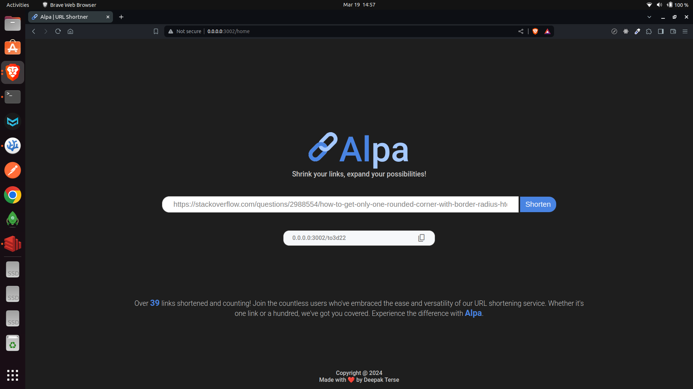
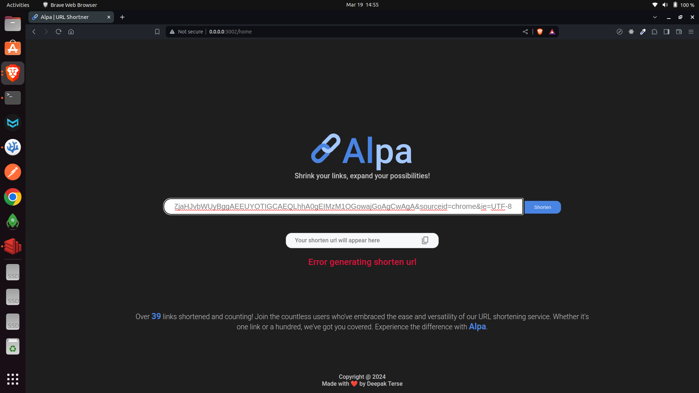

# Pomodoro Clock



Use our timer based on ancient Chinnese pomodoro technique for time management and improved productivity

## About the App

A Pomodoro Clock is based on the ancient Chineese time management technique in which one breaks the workday down into manageable 25-minute segments called 'Pomodoros. The app lets you start stop the timer and also alerts you as the timer ends. 

## Key Features

- **Pomodoros Tracking**: Keep track of the number of promodoros completed in a day

- **Play/Pause**: Play/Pause the timer anytime for unplanned activities.

- **Timer Alert**: Get notified with an alert sound at the end of every timer.

## Technologies Used

- **React**: A next-generation web framework for Node. js that prioritizes speed, efficiency, and developer experience.

- **EJS**: A templating engine used by Node JS to create HTML template with minimal code.

- **Redis**: An in-memory data structure store utilized as a database and cache.

## Screenshots

_Home Page (Desktop)_


_Home Page (Mobile)_

 


## Getting Started

1. Clone this repository: `git clone https://github.com/deepak-terse/alpa.git`
2. Navigate to the project directory: `cd alpa`
3. Install dependencies: `npm install`
4. Setup Redis either locally or on RedisLab and store the credentials.
5. Run Redis server using `sudo systemctl start redis-server` (for local setup)
5. Create an `.env` file and configure this details
    ```
    # NODE
    NODE_ENV=development
    HOST=X.X.X.X
    PORT=XXXX

    # REDIS
    REDIS_HOST=X.X.X.X
    REDIS_PORT=XXXX
    ```
6. Run the app: `npm start-ts`

Enjoy using Alpa for your URL shortening needs! If you encounter any issues or have suggestions, please feel free to open an issue or reach out to us. Happy URL shortening! 🔖🌟